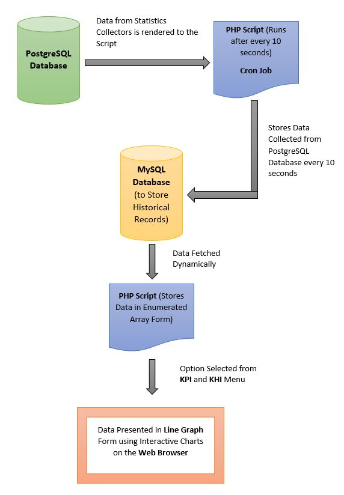

# PostgreSQL Performance and Health Monitoring
_Description_: A monitoring tool to visualize real-time PostgreSQL database key performance and health indicators.

This project deals with designing a performance and health indicators analysis system. The system will analyze the software components present in the CentOS appliance. There are two types of indicators for any software or application, they are:

* Key Performance Indicators (KPI’s): A performance indicator or key performance indicator (KPI) is a type of performance measurement. KPIs evaluate the success of an application or system. Accordingly, choosing the right KPIs relies upon a good understanding of what is important to the application. These assessments often lead to the identification of potential improvements, so performance indicators are routinely associated with 'performance improvement' initiatives.

* Key Health Indicators (KHI’s): Key Health Indicators are performance counters with thresholds aimed at revealing user experience issues. These indicators also tell how well the appliance or application performing now is and will warn at events causing harm to the health of the application. Hence, health is measured as a separate and as a single parameter.

## PostgreSQL Tracer Flow Diagram

